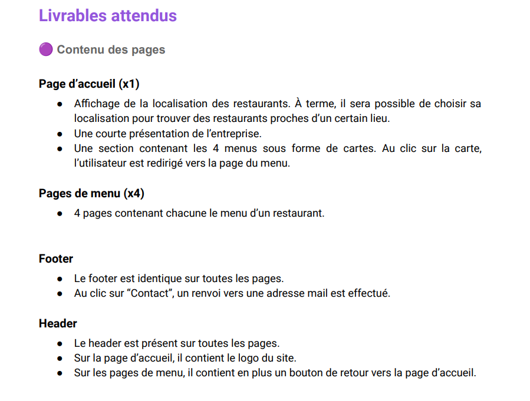
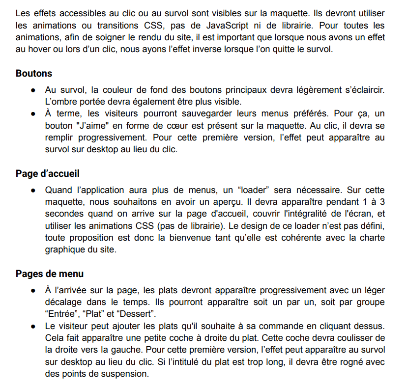

**_Projet n°4 de la formation integrateur web de openclassrooms._**

**_le projet OhMyFood suis les indication demandé :_**

> suivre la maquette

**_technologie utilisé_**

> Le développement doit se faire en CSS avec Sass, sans JavaScript

> Les fichiers sources .scss ainsi que le code compilé CSS doivent être disponibles
> dans un ou plusieurs fichiers dédiés.

> Le site devra être réalisé en adoptant le Mobile First, c’est-à-dire qu’il faudra d’abord
> réaliser l’intégration de la maquette mobile, puis tablette, et enfin l’intégration du
> responsive vers le desktop

> Aucun framework ne devra être utilisé (comme Bootstrap par exemple).

> Aucun code CSS ne doit être appliqué via un attribut style dans une balise HTML.

> Tout le code doit être versionné sur GitHub avec des commits réguliers pour
> suivre l’avancement et publier le site en ligne plus facilement.

> Le site devra être accessible sur GitHub une fois terminé.

**_compatibilité_**

> le site est développé en utilisant
> l’approche mobile-first

> Les pages passent la validation W3C en HTML et CSS sans erreur.

> L’ensemble du site doit être responsive sur mobile, tablette et desktop.

**_livrable attendu_**

**Effets graphiques et animations**

